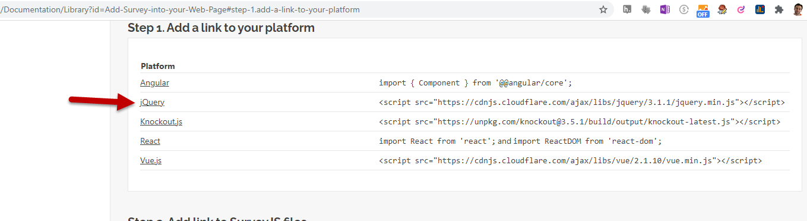
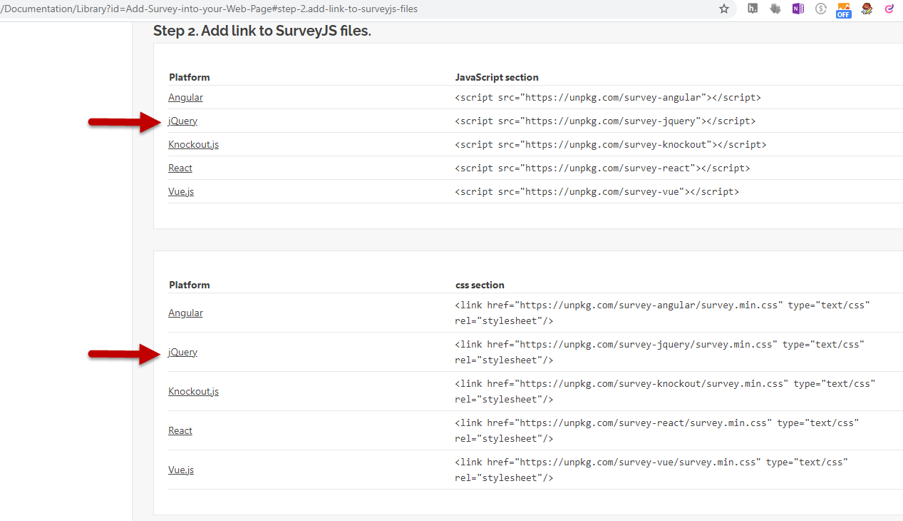
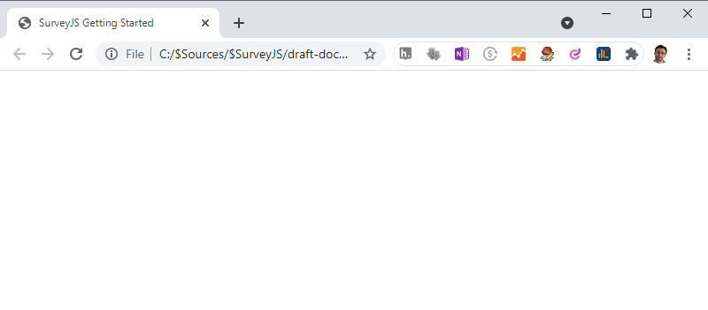
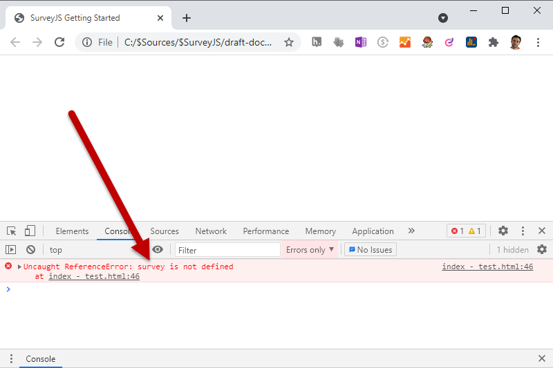
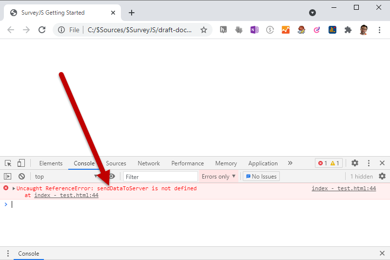
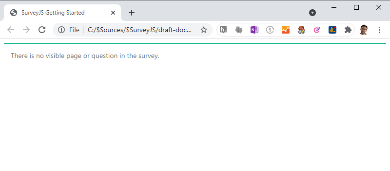
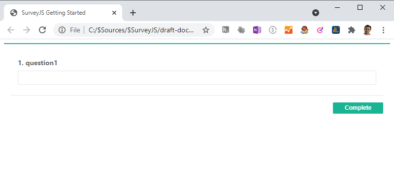
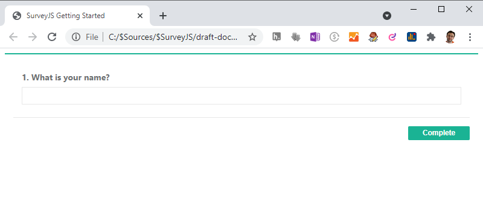
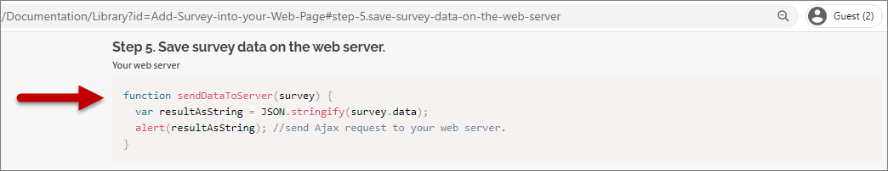
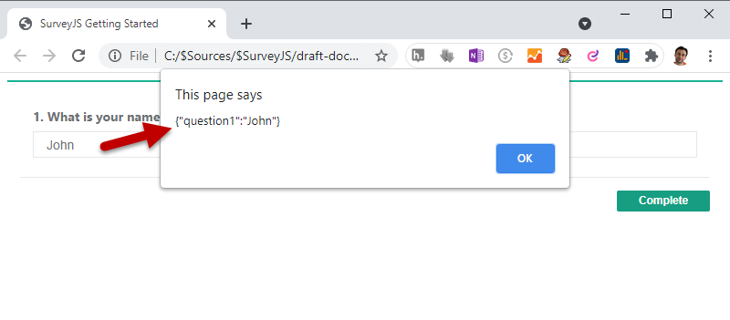

# Getting Started with SurveyJS - The Very Basics

This tutorial will help you get started using the SurveyJS Library. You will learn how to create a simple web page with a working instance of a SurveyJS-powered survey.

The topic contains the following sections.

* [Create an empty web page based on HTML5 template](#Create-an-empty-web-page-based-on-HTML5-template)
* [Get required scripts and stylesheets](#Get-required-scripts-and-stylesheets)
* [Add a survey instance to the page](#Add-a-survey-instance-to-the-page)
* [Define survey content through JSON](#Define-survey-content-through-JSON)
* [Get user answers](#Get-user-answers)


 At the end you will have a webpage with the following code. 
 
 <details>
    <summary>View the resulting code</summary>  

```html
<!DOCTYPE html>
<html>
<head>
    <title>My first SurveyJS survey</title>
    <meta charset="utf-8">
    <script src="https://cdnjs.cloudflare.com/ajax/libs/jquery/3.1.1/jquery.min.js"></script>
    <script src="https://unpkg.com/survey-jquery"></script>
    <link href="https://unpkg.com/survey-jquery/survey.min.css" type="text/css" rel="stylesheet"/>
</head>
<body>
    <div id="surveyContainer"></div>
    <script>
        function onCompleteHandler(sender) {
            var resultAsString = JSON.stringify(sender.data);
            alert(resultAsString); 
        }    
        var surveyJSON = { 
            pages: [
                { 
                    elements: [
                        {
                            title: "What is your name?",
                            type: "text"
                        }
                    ] 
                }
            ] 
        };
        var survey = new Survey.Model(surveyJSON);
        survey.onComplete.add(onCompleteHandler);
        $("#surveyContainer").Survey({model:survey});
    </script>
</body>
</html>
```
 
Check this code on GitHub: [index.html](https://github.com/surveyjs/code-examples/blob/main/getting-started-the-very-basics/index.html)  
See the code [in action](https://surveyjs.github.io/code-examples/getting-started-the-very-basics).
</details>  


<a id="Create-an-empty-web-page-based-on-HTML5-template"></a>
## Create an empty web page based on HTML5 template
Begin with an empty HTML document, such as `index.html`. You can create and edit it using any text editor, even Notepad. 

<!--
This tutorial uses [Visual Studio Code](https://code.visualstudio.com/) as a code editor (_it is more suitable for a video lesson_).
-->

SurveyJS libraries require the HTML5 doctype to function properly. To create a new HTML5 document, you can insert the following [w3.org template](https://www.w3.org/QA/2002/04/valid-dtd-list.html#Template)'s markup into the page. 

````html
<!DOCTYPE html>
<html>
<head>
    <title><!-- Your title here --></title>
    <meta charset="utf-8">
</head>
<body>
    <!-- Your HTML content here -->
</body>
</html>
````
Specify the page title (set it to "My first SurveyJS survey").  
Now you have a simple web page ready to incorporate a SurveyJS survey into it.

<details>
    <summary>View page code</summary>  

```html
<!DOCTYPE html>
<html>
<head>
    <title>My first SurveyJS survey</title>
    <meta charset="utf-8">
</head>
<body>
    <!-- Your HTML content here -->
</body>
</html>
```
</details>  
  

<a id="Get-required-scripts-and-stylesheets"></a>
## Get required scripts and stylesheets

In order to use SurveyJS, you must attach the required resources - JavaScript and CSS files - to your webpage. Referencing them from CDNs (content delivery networks) is the simplest and fastest way to load the resources.

### Link platform-related resources

This tutorial will use the [jQuery](https://jquery.com/) framework to create a survey. So you need to load a jQuery library from the jQuery CDN.

To quickly find a particular link to insert into the page, open the SurveyJS documentation's [Add a link to your platform scripts](https://surveyjs.io/Documentation/Library?id=Add-Survey-into-your-Web-Page#step-1.add-a-link-to-your-platform) section and search for the related platform reference in the section's table. 



For the jQuery platform, use the following link:    
`<script src="https://cdnjs.cloudflare.com/ajax/libs/jquery/3.1.1/jquery.min.js"></script>`

Insert it to the `<script>` tag within the page's `<head>` section.  

<details>
    <summary>View page code</summary>  

```html
<!DOCTYPE html>
<html>
<head>
    <title>My first SurveyJS survey</title>
    <meta charset="utf-8">
    <!-- A reference to the jQuery script goes here: -->
    <script src="https://cdnjs.cloudflare.com/ajax/libs/jquery/3.1.1/jquery.min.js"></script>
</head>
<body>
    <!-- Your HTML content here -->
</body>
</html>
```
</details>  


### Link SurveyJS resources

To find out which SurveyJS-related resources to attach, open the documentation's [Add links to SurveyJS files](https://surveyjs.io/Documentation/Library?id=Add-Survey-into-your-Web-Page#step-2.add-link-to-surveyjs-files) section and find the jQuery-related links in both tables within the section.



The tables suggest using the following links:
 - a script link:  
`<script src="https://unpkg.com/survey-jquery"></script>`  
 - a CSS link:  
`<link href="https://unpkg.com/survey-jquery/survey.min.css" type="text/css" rel="stylesheet"/>`


Copy these links and paste them into the webpage's `<head>` section.

<details>
    <summary>View page code</summary>  

```html
<!DOCTYPE html>
<html>
<head>
    <title>My first SurveyJS survey</title>
    <meta charset="utf-8">
    <script src="https://cdnjs.cloudflare.com/ajax/libs/jquery/3.1.1/jquery.min.js"></script>
    <!-- A reference to the jQuery-related SurveyJS script: -->
    <script src="https://unpkg.com/survey-jquery"></script>
    <!-- A reference to the jQuery-related SurveyJS css: -->
    <link href="https://unpkg.com/survey-jquery/survey.min.css" type="text/css" rel="stylesheet"/>
</head>
<body>
    <!-- Your HTML content here -->
</body>
</html>
```
</details>  

Open the webpage in a browser and see that currently the page is empty. This is because no content is defined within the page so far.




<a id="Add-a-survey-instance-to-the-page"></a>
## Add a survey instance to the page

After you attach all required resources, you can modify the page body to add a survey to the page. 

### Insert markup and script

Refer to the documentation's [Add jQuery-related survey into web page](https://surveyjs.io/Documentation/Library?id=Add-Survey-into-your-Web-Page#jquery-inside-your-web-page) section to learn which code to use to create a survey instance. Due to this article, you should do the following:

- **Add a survey container** - an HTML element to render a survey.

    ```html
    <div id="surveyContainer"></div>
    ```

- **Add a script** to create a survey instance within the container.

    ````html
    <script>
        var survey = new Survey.Model(surveyJSON);
        survey.onComplete.add(sendDataToServer);
        $("#surveyContainer").Survey({model:survey});
    </script>
    ````

 In general, SurveyJS registers a jQuery function - [Survey()](https://github.com/surveyjs/survey-library/blob/48ad72218b5216f3b3375fd62c09fbc99da1f6ae/src/entries/jquery.ts#L31-L36) - which you can call on a jQuery selector identifying the survey container (`#surveyContainer`) to render a survey (a [SurveyModel](https://surveyjs.io/Documentation/Library?id=surveymodel) class instance) created through `Survey.Model()` based on the provided survey definition in JSON format (`surveyJSON`). The survey's [onComplete](https://surveyjs.io/Documentation/Library?id=surveymodel#onComplete) event is assigned with a handler to collect user answers.  

>Related API used in code (see links to sources):<pre>
var survey = new [Survey](https://github.com/surveyjs/survey-library/blob/737086cc7993e560bb3513f464e064a19b728c31/src/knockout/kosurvey.ts#L26).[Model](https://github.com/surveyjs/survey-library/blob/737086cc7993e560bb3513f464e064a19b728c31/src/entries/jquery.ts#L24-L25)(surveyJSON);
[survey](https://github.com/surveyjs/survey-library/blob/48ad72218b5216f3b3375fd62c09fbc99da1f6ae/src/survey.ts#L50).[onComplete](https://github.com/surveyjs/survey-library/blob/48ad72218b5216f3b3375fd62c09fbc99da1f6ae/src/survey.ts#L105-L118).[add](https://github.com/surveyjs/survey-library/blob/48ad72218b5216f3b3375fd62c09fbc99da1f6ae/src/base.ts#L1613)(sendDataToServer);
$("#surveyContainer").[Survey](https://github.com/surveyjs/survey-library/blob/48ad72218b5216f3b3375fd62c09fbc99da1f6ae/src/entries/jquery.ts#L31-L36)({[model](https://github.com/surveyjs/survey-library/blob/48ad72218b5216f3b3375fd62c09fbc99da1f6ae/src/entries/jquery.ts#L33):survey});
</pre>


Insert the above code pieces (DIV and script) into the page's `<body>`.

<details>
    <summary>View page code</summary>  

```html
<!DOCTYPE html>
<html>
<head>
    <title>My first SurveyJS survey</title>
    <meta charset="utf-8">
    <script src="https://cdnjs.cloudflare.com/ajax/libs/jquery/3.1.1/jquery.min.js"></script>
    <script src="https://unpkg.com/survey-jquery"></script>
    <link href="https://unpkg.com/survey-jquery/survey.min.css" type="text/css" rel="stylesheet"/>
</head>
<body>
    <!-- A DIV container where to render a survey: -->
    <div id="surveyContainer"></div>
    <!-- A script that instantiates a survey and renders it into the designated DIV container: -->
    <script>
        var survey = new Survey.Model(surveyJSON);
        survey.onComplete.add(sendDataToServer);
        $("#surveyContainer").Survey({model:survey});
    </script>
</body>
</html>
```
</details>  


### Run the page and check errors

If you open the webpage in a browser, you still see an empty page without any content. 

You can find the reason in the browser's Developer Tools (F12) - its Console indicates an error: the `surveyJSON` variable is not defined.  



The cause of this error might be the `surveyJSON` variable which is passed as a parameter in the following code line but has not been defined anywhere within code.  
`var survey = new Survey.Model(surveyJSON);`  

Let us define this variable and temporarily set it to null to find out whether the page will be rendered without errors.  
`var surveyJSON = null;`  
`var survey = new Survey.Model(surveyJSON);`  

<details>
    <summary>View page code</summary>  

```html
<!DOCTYPE html>
<html>
<head>
    <title>My first SurveyJS survey</title>
    <meta charset="utf-8">
    <script src="https://cdnjs.cloudflare.com/ajax/libs/jquery/3.1.1/jquery.min.js"></script>
    <script src="https://unpkg.com/survey-jquery"></script>
    <link href="https://unpkg.com/survey-jquery/survey.min.css" type="text/css" rel="stylesheet"/>
</head>
<body>
    <div id="surveyContainer"></div>
    <script>
        //Define the missed surveyJSON variable and try setting it to null.
        var surveyJSON = null;
        var survey = new Survey.Model(surveyJSON);
        survey.onComplete.add(sendDataToServer);
        $("#surveyContainer").Survey({model:survey});
    </script>
</body>
</html>
```
</details>  


Open the page once again. Now a browser still displays an empty page and the Developer Tools' Console shows another error - the `sendDataToServer` method is not defined at this time.  



A simple workaround that comes to mind to get rid of this error is to comment the following code line:  
`onComplete:sendDataToServer` 

<details>
    <summary>View page code</summary>  

```html
<!DOCTYPE html>
<html>
<head>
    <title>My first SurveyJS survey</title>
    <meta charset="utf-8">
    <script src="https://cdnjs.cloudflare.com/ajax/libs/jquery/3.1.1/jquery.min.js"></script>
    <script src="https://unpkg.com/survey-jquery"></script>
    <link href="https://unpkg.com/survey-jquery/survey.min.css" type="text/css" rel="stylesheet"/>
</head>
<body>
    <div id="surveyContainer"></div>
    <script>
        var surveyJSON = null;
        var survey = new Survey.Model(surveyJSON);
        //Comment the following line to get rid of an error:
        //survey.onComplete.add(sendDataToServer);
        $("#surveyContainer").Survey({model:survey});
    </script>
</body>
</html>
```
</details>  


When you open the webpage, you see that now errors are gone and the page is not blank - it contains the following explanatory text: 

`There is no visible page or question within the survey.`



This means that a survey instance is created successfully but does not yet have any definition of its content, such as pages and/or questions. It is logical to assume that this is due to the `surveyJSON` variable which you previously set to null (instead of declaring the necessary content). As a result, SurveyJS renders the above "no content" text into the DIV specified as a container for the survey markup.

Now you are ready to define the survey content to create your first survey and make it functional within a browser's page.


<a id="Define-survey-content-through-JSON"></a>
## Define survey content through JSON

To structure a survey, form a proper JSON survey definition. 

Initially, change the `surveyJSON` variable's value - replace `null` with curly brackets `{}` to specify a JSON object which will define the model of a survey ([SurveyModel](https://surveyjs.io/Documentation/Library?id=SurveyModel)).

```javascript
var surveyJSON = {};
```

### Create a survey page

Start defining a survey with its root structure element - a page. Create a [pages](https://surveyjs.io/Documentation/Library?id=surveymodel#pages) array and insert a single page object ([PageModel](https://surveyjs.io/Documentation/Library?id=PageModel)) into it:  
`pages: [{}]`

```javascript
var surveyJSON = { 
    //Insert a page:
    pages: [{}] 
};
```


### Create a survey element within the page

Pages are base containers for other survey elements, such as panels and questions. To create a simple survey element, define an [elements](https://surveyjs.io/Documentation/Library?id=PageModel#elements) array within the page and insert a single element ([IElement](https://github.com/surveyjs/survey-library/blob/4c3b31cf2cd893f40fff837e9e7140db7365baca/src/base.ts#L235)) into the array:  
`elements: [{}]`

```js
var surveyJSON = { 
    pages: [
        { 
            //Insert a survey element:
            elements: [{}] 
        }
    ] 
};
```

### Specify the survey element's type

Specify the type of the created element to help SurveyJS understand how to render this element - as a question ([text](https://surveyjs.io/Documentation/Library?id=questiontextmodel), [checkbox](https://surveyjs.io/Documentation/Library?id=questioncheckboxmodel), [dropdown](https://surveyjs.io/Documentation/Library?id=questiondropdownmodel), etc.), as a panel ([static](https://surveyjs.io/Documentation/Library?id=panelmodel) or [dynamic](https://surveyjs.io/Documentation/Library?id=questionpaneldynamicmodel)), as an [image](https://surveyjs.io/Documentation/Library?id=questionimagemodel) or [HTML](https://surveyjs.io/Documentation/Library?id=questionhtmlmodel) container, and so on.  

Set the element's **type** property to `"text"` to display this element as a simple text question ([QuestionTextModel](https://surveyjs.io/Documentation/Library?id=questiontextmodel)). This question uses a textbox for user input.  

`type: "text"`

```js
var surveyJSON = { 
    pages: [
        { 
            elements: [
                {
                    //Specify the element's type:
                    type: "text"
                }
            ] 
        }
    ] 
};
```

<details>
    <summary>View page code</summary>  

```html
<!DOCTYPE html>
<html>
<head>
    <title>My first SurveyJS survey</title>
    <meta charset="utf-8">
    <script src="https://cdnjs.cloudflare.com/ajax/libs/jquery/3.1.1/jquery.min.js"></script>
    <script src="https://unpkg.com/survey-jquery"></script>
    <link href="https://unpkg.com/survey-jquery/survey.min.css" type="text/css" rel="stylesheet"/>
</head>
<body>
    <div id="surveyContainer"></div>
    <script>
        var surveyJSON = { 
            pages: [
                { 
                    elements: [
                        {
                            type: "text"
                        }
                    ] 
                }
            ] 
        };
        var survey = new Survey.Model(surveyJSON);
        //survey.onComplete.add(sendDataToServer);
        $("#surveyContainer").Survey({model:survey});
    </script>
</body>
</html>
```
</details>  

Open the webpage in a browser and see a functional survey that contains a single text question (to collect a response from a user) and a 'Complete' button (to submit user responses).



As you can see, the text question displays a textbox editor with an automatically generated title. The title text - "question1" - is by default taken from the element's [name](https://surveyjs.io/Documentation/Library?id=SurveyElement#name) property value. The `name` property is used to uniquely identify elements. If not defined explicitly, its value is formed automatically by combining the text `question` with the element's position within the survey - `1` in the current case).


### Specify the survey element's title

Let us give a meaningful title to the question to point respondents to the question subject.  
Add the [title](https://surveyjs.io/Documentation/Library?id=questiontextmodel#title) property and set it as follows.


`title: "What is your name?",`

```js
var surveyJSON = { 
    pages: [
        { 
            elements: [
                {
                    //Specify the question's title:
                    title: "What is your name?",
                    type: "text"
                }
            ] 
        }
    ] 
};
```

<details>
    <summary>View page code</summary>  

```html
<!DOCTYPE html>
<html>
<head>
    <title>My first SurveyJS survey</title>
    <meta charset="utf-8">
    <script src="https://cdnjs.cloudflare.com/ajax/libs/jquery/3.1.1/jquery.min.js"></script>
    <script src="https://unpkg.com/survey-jquery"></script>
    <link href="https://unpkg.com/survey-jquery/survey.min.css" type="text/css" rel="stylesheet"/>
</head>
<body>
    <div id="surveyContainer"></div>
    <script>
        var surveyJSON = { 
            pages: [
                { 
                    elements: [
                        {
                            //Specify the question's title:
                            title: "What is your name?",
                            type: "text"
                        }
                    ] 
                }
            ] 
        };
        var survey = new Survey.Model(surveyJSON);
        //survey.onComplete.add(sendDataToServer);
        $("#surveyContainer").Survey({model:survey});
    </script>
</body>
</html>
```
</details>  

Now the title indicates the question purpose and helps users provide correct answers.




<a id="Get-user-answers"></a>
## Get user answers

In response to a click on the 'Complete' button, SurveyJS forms a JSON object (survey response) with collected user answers. This JSON typically contains an array of key/value pairs where the key is a question's identifier (name) and the value is the user answer to the question.

To get access to a survey response JSON, handle the survey's [onComplete](https://surveyjs.io/Documentation/Library?id=surveymodel#onComplete) event and obtain the [sender.data](https://surveyjs.io/Documentation/Library?id=surveymodel#data) property's value in the event handler.

For this purpose, you can do the following.

Open the [Save survey data on the web server](https://surveyjs.io/Documentation/Library?id=Add-Survey-into-your-Web-Page#step-5.save-survey-data-on-the-web-server) documentation section and copy the code from its "Your web server" part. 



```js
function sendDataToServer(sender) {
    var resultAsString = JSON.stringify(sender.data);
    alert(resultAsString); //Send an AJAX request to your web server here...
}
```


Insert the code into your page's `<body>`, into the `<script>` section, right before the `surveyJSON` variable definition.  


<details>
    <summary>View page code</summary>  

```html
<!DOCTYPE html>
<html>
<head>
    <title>My first SurveyJS survey</title>
    <meta charset="utf-8">
    <script src="https://cdnjs.cloudflare.com/ajax/libs/jquery/3.1.1/jquery.min.js"></script>
    <script src="https://unpkg.com/survey-jquery"></script>
    <link href="https://unpkg.com/survey-jquery/survey.min.css" type="text/css" rel="stylesheet"/>
</head>
<body>
    <div id="surveyContainer"></div>
    <script>
        // Insert the handling function implementation.
        function sendDataToServer(sender) {
            var resultAsString = JSON.stringify(sender.data);
            alert(resultAsString); //In a real app, send data to your web server here...
        }    
        var surveyJSON = { 
            pages: [
                { 
                    elements: [
                        {
                            title: "What is your name?",
                            type: "text"
                        }
                    ] 
                }
            ] 
        };
        var survey = new Survey.Model(surveyJSON);
        //survey.onComplete.add(sendDataToServer);
        $("#surveyContainer").Survey({model:survey});
    </script>
</body>
</html>
```
</details>  


Uncomment the following (previously commented) code line that assigns an `onComplete` event handler:  
`//survey.onComplete.add(sendDataToServer);`


Finally, you can find it useful to change the handling function name from 'sendDataToServer' to 'onCompleteHandler' since in the context of this tutorial, you do not send any data to a server but just preview them in an alert message.

The webpage's result code looks as follows.

```html
<!DOCTYPE html>
<html>
<head>
    <title>My first SurveyJS survey</title>
    <meta charset="utf-8">
    <script src="https://cdnjs.cloudflare.com/ajax/libs/jquery/3.1.1/jquery.min.js"></script>
    <script src="https://unpkg.com/survey-jquery"></script>
    <link href="https://unpkg.com/survey-jquery/survey.min.css" type="text/css" rel="stylesheet"/>
</head>
<body>
    <div id="surveyContainer"></div>
    <script>
        function onCompleteHandler(sender) {
            var resultAsString = JSON.stringify(sender.data);
            alert(resultAsString); 
        }    
        var surveyJSON = { 
            pages: [
                { 
                    elements: [
                        {
                            title: "What is your name?",
                            type: "text"
                        }
                    ] 
                }
            ] 
        };
        var survey = new Survey.Model(surveyJSON);
        survey.onComplete.add(onCompleteHandler);
        $("#surveyContainer").Survey({model:survey});
    </script>
</body>
</html>
```

Open the page, answer the question, and click the 'Complete' button. You see the collected data in the alert message box.



Pay attention to the data format. It is a JSON containing an array with a single item - a key/value pair that represents a user answer to the question. In this item, the key is the [name](https://surveyjs.io/Documentation/Library?id=SurveyElement#name) ("question1") that identifies the question and the value is the text ("John") entered into the question's textbox.

In a real application, you will need to process the obtained response data by passing a survey response JSON to a server and saving to a store of survey data. 


<a id="Conclusion"></a>
## Conclusion

From this tutorial, you have learned how to create a simple survey, display it on a web page and get access to its user responses.

In the next lessons you will know how to define more complex survey scenarios.

