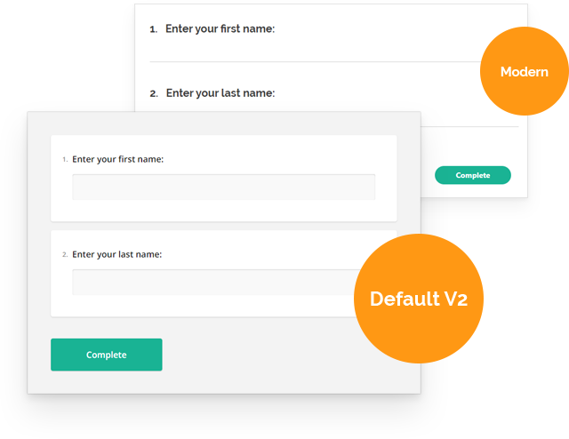
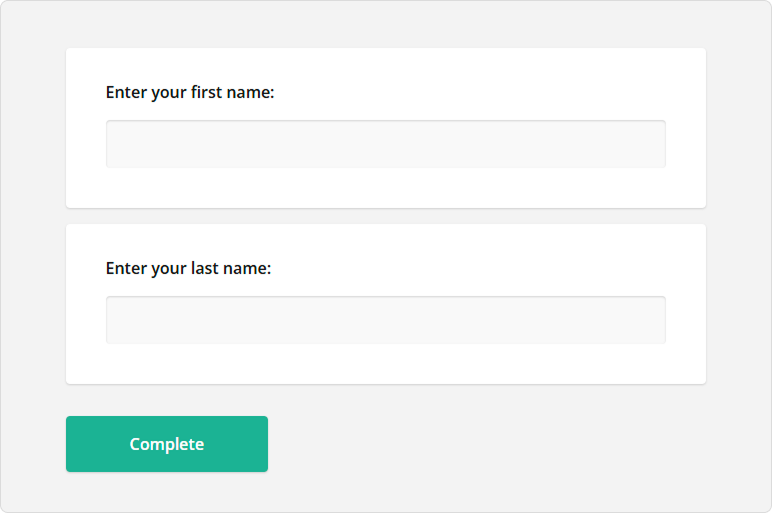
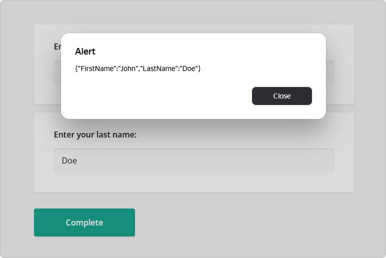

# Angular Form Library

SurveyJS Form Library for Angular is a client-side component that uses JSON objects to render dynamic forms in Angular applications and send submission data to a database for storage. These JSON objects contain key-value pairs representing various aspects of a form, including descriptions of each form field, instructions on how to organize form fields on the page, and how the form should behave in response to user interactions, such as submitting data, validating input, and displaying error messages. By loading the JSON schemas that define form layout and content, the rendering Form Library dynamically generates the corresponding HTML elements and displays them on a web page.

This step-by-step tutorial will help you get started with the SurveyJS Form Library in an Angular application. To add a form to your Angular application, follow the steps below:

- [Install the `survey-angular-ui` npm Package](#install-the-survey-angular-ui-npm-package)
- [Configure Styles](#configure-styles)
- [Create a Model](#create-a-model)
- [Render the Form](#render-the-form)
- [Handle Form Completion](#handle-form-completion)

As a result, you will create a form displayed below:

<iframe src="/proxy/github/code-examples/get-started-library/knockout/index.html"
    style="width:100%; border:0; border-radius: 4px; overflow:hidden;"
></iframe>

[View Full Code on GitHub](https://github.com/surveyjs/code-examples/tree/main/get-started-library/angular (linkStyle))

If you are looking for a quick-start application that includes all SurveyJS components, refer to the following GitHub repository: <a href="https://github.com/surveyjs/surveyjs_angular_cli" target="_blank">SurveyJS + Angular CLI Quickstart Template</a>.

## Install the `survey-angular-ui` npm Package

The SurveyJS Form Library for Angular consists of two npm packages: [`survey-core`](https://www.npmjs.com/package/survey-core) (platform-independent code) and [`survey-angular-ui`](https://www.npmjs.com/package/survey-angular-ui) (rendering code). Run the following command to install `survey-angular-ui`. The `survey-core` package will be installed automatically because it is listed in `survey-angular-ui` dependencies.

```cmd
npm install survey-angular-ui --save
```

> SurveyJS for Angular requires Angular v12.0.0 or newer and depends on the `@angular/cdk` package. If your project does not include it yet, run the following command:
>
> ```cmd
> npm install @angular/cdk@^12.0.0 --save
> ```
>
> Earlier Angular versions are supported by the [`survey-angular`](https://www.npmjs.com/package/survey-angular) package. It depends on Knockout and is now obsolete. However, you can use it in your Angular v8&ndash;v11 projects. Refer to the following examples on GitHub for more information:
> 
> - [Add SurveyJS Form Library to an Angular v8&ndash;v11 Application](https://github.com/surveyjs/code-examples/tree/main/legacy-angular/form-library)
> - [Add Survey Creator to an Angular v8&ndash;v11 Application](https://github.com/surveyjs/code-examples/tree/main/legacy-angular/survey-creator).

## Configure Styles

SurveyJS Form Library is shipped with several predefined themes illustrated below and a flexible theme customization mechanism based on CSS variables.



To add SurveyJS themes to your Angular application, open the `angular.json` file and reference the Form Library style sheet:

```js
{
  "$schema": "./node_modules/@angular/cli/lib/config/schema.json",
  // ...
  "projects": {
    "project-name": {
      "projectType": "application",
      // ...
      "architect": {
        "build": {
          // ...
          "options": {
            // ...
            "styles": [
              "src/styles.css",
              "node_modules/survey-core/defaultV2.min.css",
            ],
            // ...
          }
        }
      }
    }
  }
}
```

This style sheet applies the Default theme. If you want to apply a different predefined theme or create a custom theme, refer to the following help topic for detailed instructions: [Themes & Styles](https://surveyjs.io/form-library/documentation/manage-default-themes-and-styles).

> Previous to v1.9.100, SurveyJS also supplied the Modern theme, which is now obsolete. Please migrate to one of the predefined themes or create a custom theme.

## Create a Model

A model describes the layout and contents of your survey. The simplest form model contains one or several questions without layout modifications.

Models are specified by model schemas (JSON objects). For example, the following model schema declares two [textual questions](https://surveyjs.io/Documentation/Library?id=questiontextmodel), each with a [title](https://surveyjs.io/Documentation/Library?id=questiontextmodel#title) and a [name](https://surveyjs.io/Documentation/Library?id=questiontextmodel#name). Titles are displayed on screen. Names are used to identify the questions in code.

```js
const surveyJson = {
  elements: [{
    name: "FirstName",
    title: "Enter your first name:",
    type: "text"
  }, {
    name: "LastName",
    title: "Enter your last name:",
    type: "text"
  }]
};
```

To instantiate a model, pass the model schema to the [Model](https://surveyjs.io/Documentation/Library?id=surveymodel) constructor as shown in the code below. Assign the model instance to a component property. The model instance will be later used to render the survey. 

```js
import { Component, OnInit } from '@angular/core';
import { ..., Model } from "survey-core";

@Component({
  // ...
})
export class AppComponent implements OnInit {
  surveyModel: Model;
  ngOnInit() {
    const survey = new Model(surveyJson);
    this.surveyModel = survey;
  }
}
```

<details>
    <summary>View Full Code</summary>  

```js
import { Component, OnInit } from '@angular/core';
import { Model } from "survey-core";

const surveyJson = {
  elements: [{
    name: "FirstName",
    title: "Enter your first name:",
    type: "text"
  }, {
    name: "LastName",
    title: "Enter your last name:",
    type: "text"
  }]
};

@Component({
  selector: 'app-root',
  templateUrl: './app.component.html',
  styleUrls: ['./app.component.css']
})
export class AppComponent implements OnInit {
  title = 'My First Survey';
  surveyModel: Model;
  ngOnInit() {
    const survey = new Model(surveyJson);
    this.surveyModel = survey;
  }
}
```
</details>

<a id="render-the-survey"></a>

## Render the Form

Before you render the survey, you need to import the module that integrates the SurveyJS Form Library with Angular. Open your NgModule class (usually resides in the `app.module.ts` file), import the `SurveyModule` from `survey-angular-ui`, and list it in the `imports` array.

```js
// app.module.ts
// ...
import { SurveyModule } from "survey-angular-ui";

@NgModule({
  declarations: [ ... ],
  imports: [
    ...,
    SurveyModule
  ],
  providers: [ ... ],
  bootstrap: [ ... ]
})
export class AppModule { }

```

To render a survey, add a `<survey>` element to your component template and bind the element's `model` attribute to the model instance you created in the previous step:

```html
<survey [model]="surveyModel"></survey>
```

If you replicate the code correctly, you should see the following survey:



<details>
    <summary>View Full Code</summary>  

```html
<!-- app.component.html -->
<survey [model]="surveyModel"></survey>
```

```js
// app.component.ts
import { Component, OnInit } from '@angular/core';
import { Model } from "survey-core";

const surveyJson = {
  elements: [{
    name: "FirstName",
    title: "Enter your first name:",
    type: "text"
  }, {
    name: "LastName",
    title: "Enter your last name:",
    type: "text"
  }]
};

@Component({
  selector: 'app-root',
  templateUrl: './app.component.html',
  styleUrls: ['./app.component.css']
})
export class AppComponent implements OnInit {
  title = 'My First Survey';
  surveyModel: Model;
  ngOnInit() {
    const survey = new Model(surveyJson);
    this.surveyModel = survey;
  }
}
```

```js
// app.module.ts
import { BrowserModule } from '@angular/platform-browser';
import { NgModule } from '@angular/core';
import { SurveyModule } from "survey-angular-ui";

import { AppComponent } from './app.component';

@NgModule({
  declarations: [
    AppComponent
  ],
  imports: [
    BrowserModule,
    SurveyModule
  ],
  providers: [],
  bootstrap: [AppComponent]
})
export class AppModule { }
```
</details>

<a id="handle-survey-completion"></a>

## Handle Form Completion

After a respondent completes a survey, the results are available within the [`onComplete`](https://surveyjs.io/Documentation/Library?id=surveymodel#onComplete) event handler. In real-world applications, you should send the results to a server where they will be stored in a database and processed. If your application has a user identification system, you can add the user ID to the survey results before sending them to the server:

```js
import { Component, OnInit } from '@angular/core';
import { ..., Model } from "survey-core";

const SURVEY_ID = 1;

@Component({
  // ...
})
export class AppComponent implements OnInit {
  surveyComplete (survey) {
    const userId = /* ... Getting the user ID ... */
    survey.setValue("userId", userId);

    saveSurveyResults(
      "https://your-web-service.com/" + SURVEY_ID,
      survey.data
    )
  }
  ngOnInit() {    
    const survey = new Model(surveyJson);
    survey.onComplete.add(this.surveyComplete);
    // ...
  }
}

function saveSurveyResults(url, json) {
  fetch(url, {
    method: 'POST',
    headers: {
      'Content-Type': 'application/json;charset=UTF-8'
    },
    body: JSON.stringify(json)
  })
  .then(response => {
    if (response.ok) {
      // Handle success
    } else {
      // Handle error
    }
  })
  .catch(error => {
    // Handle error
  });
}
```

In this tutorial, the results are simply output in an alert dialog:

```js
import { Component, OnInit } from '@angular/core';
import { ..., Model } from "survey-core";

@Component({
  // ...
})
export class AppComponent implements OnInit {
  alertResults (sender) {
    const results = JSON.stringify(sender.data);
    alert(results);
  }
  ngOnInit() {
    // ...
    const survey = new Model(surveyJson);
    survey.onComplete.add(this.alertResults);
    // ...
  }
}
```


As you can see, form results are saved in a JSON object. Its properties correspond to the `name` property values of your questions in the model schema.

To view the application, run `ng serve` in a command line and open [http://localhost:4200/](http://localhost:4200/) in your browser.

<details>
    <summary>View Full Code</summary>  

```html
<!-- app.component.html -->
<survey [model]="surveyModel"></survey>
```

```js
// app.component.ts
import { Component, OnInit } from '@angular/core';
import { Model } from "survey-core";

const surveyJson = {
  elements: [{
    name: "FirstName",
    title: "Enter your first name:",
    type: "text"
  }, {
    name: "LastName",
    title: "Enter your last name:",
    type: "text"
  }]
};

@Component({
  selector: 'app-root',
  templateUrl: './app.component.html',
  styleUrls: ['./app.component.css']
})
export class AppComponent implements OnInit {
  title = 'My First Survey';
  surveyModel: Model;

  alertResults (sender) {
    const results = JSON.stringify(sender.data);
    alert(results);
  }
  ngOnInit() {
    const survey = new Model(surveyJson);
    survey.onComplete.add(this.alertResults);
    this.surveyModel = survey;
  }
}
```

```js
// app.module.ts
import { BrowserModule } from '@angular/platform-browser';
import { NgModule } from '@angular/core';
import { SurveyModule } from "survey-angular-ui";

import { AppComponent } from './app.component';

@NgModule({
  declarations: [
    AppComponent
  ],
  imports: [
    BrowserModule,
    SurveyModule
  ],
  providers: [],
  bootstrap: [AppComponent]
})
export class AppModule { }
```
</details>

[View Full Code on GitHub](https://github.com/surveyjs/code-examples/tree/main/get-started-library/angular (linkStyle))

## Further Reading

- [Create a Simple Survey](https://surveyjs.io/Documentation/Library?id=design-survey-create-a-simple-survey)
- [Create a Multi-Page Survey](https://surveyjs.io/Documentation/Library?id=design-survey-create-a-multi-page-survey)
- [Create a Quiz](https://surveyjs.io/Documentation/Library?id=design-survey-create-a-quiz)
