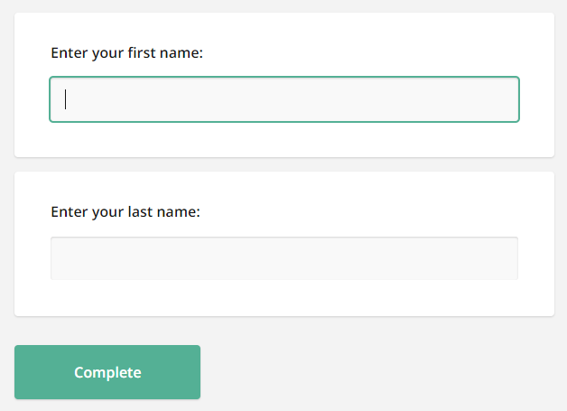

# React Form Library

SurveyJS Form Library for React is a client-side component that uses JSON objects to render dynamic forms in React applications and send submission data to a database for storage. These JSON objects contain key-value pairs representing various aspects of a form, including descriptions of each form field, instructions on how to organize form fields on the page, and how the form should behave in response to user interactions, such as submitting data, validating input, and displaying error messages. By loading the JSON schemas that define form layout and content, the rendering Form Library dynamically generates the corresponding HTML elements and displays them on a web page.

This step-by-step tutorial will help you get started with the SurveyJS Form Library in a React application. To add a form to your React application, follow the steps below:

- [Install the `survey-react-ui` npm Package](#install-the-survey-react-npm-package)
- [Configure Styles](#configure-styles)
- [Create a Model](#create-a-model)
- [Render the Form](#render-the-form)
- [Handle Form Completion](#handle-form-completion)

As a result, you will create a form displayed below:

<iframe src="/proxy/github/code-examples/get-started-library/knockout/index.html"
    style="width:100%; border:0; border-radius: 4px; overflow:hidden;"
></iframe>

[View Full Code on GitHub](https://github.com/surveyjs/code-examples/tree/main/get-started-library/react (linkStyle))

If you are looking for a quick-start application that includes all SurveyJS components, refer to the following GitHub repositories:

- <a href="https://github.com/surveyjs/surveyjs_react_quickstart" target="_blank">SurveyJS + React Quickstart Template</a>
- <a href="https://github.com/surveyjs/surveyjs-nextjs" target="_blank">SurveyJS + Next.js Quickstart Template</a>
- <a href="https://github.com/surveyjs/surveyjs-remix" target="_blank">SurveyJS + Remix Quickstart Template</a>

## Install the `survey-react-ui` npm Package

SurveyJS Form Library for React consists of two npm packages: [`survey-core`](https://www.npmjs.com/package/survey-core) (platform-independent code) and [`survey-react-ui`](https://www.npmjs.com/package/survey-react-ui) (rendering code). Run the following command to install `survey-react-ui`. The `survey-core` package will be installed automatically as a dependency.

```cmd
npm install survey-react-ui --save
```

## Configure Styles

SurveyJS Form Library is shipped with several predefined themes illustrated below and a flexible theme customization mechanism based on CSS variables.


To add SurveyJS themes to your application, open the React component that will render your form or survey and import the Form Library style sheet:

```js
import 'survey-core/defaultV2.min.css';
```

This style sheet applies the Default theme. If you want to apply a different predefined theme or create a custom theme, refer to the following help topic for detailed instructions: [Themes & Styles](https://surveyjs.io/form-library/documentation/manage-default-themes-and-styles).

> Previous to v1.9.100, SurveyJS also supplied the Modern theme, which is now obsolete. Please migrate to one of the predefined themes or create a custom theme.

## Create a Model

A model describes the layout and contents of your survey. The simplest form model contains one or several questions without layout modifications.

Models are specified by model schemas (JSON objects). For example, the following model schema declares two [textual questions](https://surveyjs.io/Documentation/Library?id=questiontextmodel), each with a [title](https://surveyjs.io/Documentation/Library?id=questiontextmodel#title) and a [name](https://surveyjs.io/Documentation/Library?id=questiontextmodel#name). Titles are displayed on screen. Names are used to identify the questions in code.

```js
const surveyJson = {
  elements: [{
    name: "FirstName",
    title: "Enter your first name:",
    type: "text"
  }, {
    name: "LastName",
    title: "Enter your last name:",
    type: "text"
  }]
};
```

To instantiate a model, pass the model schema to the [Model](https://surveyjs.io/Documentation/Library?id=surveymodel) constructor as shown in the code below. The model instance will be later used to render the survey.

```js
import { ..., Model } from 'survey-core';
// ...
function App() {
  const survey = new Model(surveyJson);

  return ... ;
}
```

<details>
    <summary>View Full Code</summary>  

```js
import 'survey-core/defaultV2.min.css';
import { Model } from 'survey-core';

const surveyJson = {
  elements: [{
    name: "FirstName",
    title: "Enter your first name:",
    type: "text"
  }, {
    name: "LastName",
    title: "Enter your last name:",
    type: "text"
  }]
};

function App() {
  const survey = new Model(surveyJson);

  return ...;
}

export default App;
```
</details>

<a id="render-the-survey"></a>

## Render the Form

To render a form, import the `Survey` component, add it to the template, and pass the model instance you created in the previous step to the component's `model` attribute, as shown below.

> If you are using [Next.js](https://nextjs.org) or another framework that [has adopted React Server Components](https://react.dev/learn/start-a-new-react-project#bleeding-edge-react-frameworks), you need to explicitly mark the React component that renders a SurveyJS component as client code using the ['use client'](https://react.dev/reference/react/use-client) directive.

```js
// Uncomment the following line if you are using Next.js:
// 'use client'

import { Survey } from 'survey-react-ui';
// ...
const surveyJson = { ... };

function App() {
  const survey = new Model(surveyJson);

  return <Survey model={survey} />;
}
```

If you replicate the code correctly, you should see the following form:



<details>
    <summary>View Full Code</summary>  

```js
// Uncomment the following line if you are using Next.js:
// 'use client'

import 'survey-core/defaultV2.min.css';
import { Model } from 'survey-core';
import { Survey } from 'survey-react-ui';

const surveyJson = {
  elements: [{
    name: "FirstName",
    title: "Enter your first name:",
    type: "text"
  }, {
    name: "LastName",
    title: "Enter your last name:",
    type: "text"
  }]
};

function App() {
  const survey = new Model(surveyJson);

  return <Survey model={survey} />;
}

export default App;
```
</details>

<a id="handle-survey-completion"></a>

## Handle Form Completion

After a respondent submits a form, the results are available within the [`onComplete`](https://surveyjs.io/Documentation/Library?id=surveymodel#onComplete) event handler. In real-world applications, you should send the results to a server where they will be stored in a database and processed. If your application has a user identification system, you can add the user ID to the survey results before sending them to the server:

```js
import { useCallback } from 'react';
// ...
const SURVEY_ID = 1;

function App() {
  const survey = new Model(surveyJson);
  const surveyComplete = useCallback((survey) => {
    const userId = /* ... Getting the user ID ... */
    survey.setValue("userId", userId);

    saveSurveyResults(
      "https://your-web-service.com/" + SURVEY_ID,
      survey.data
    )
  }, []);

  survey.onComplete.add(surveyComplete);

  return <Survey model={survey} />;
}

function saveSurveyResults(url, json) {
  fetch(url, {
    method: 'POST',
    headers: {
      'Content-Type': 'application/json;charset=UTF-8'
    },
    body: JSON.stringify(json)
  })
  .then(response => {
    if (response.ok) {
      // Handle success
    } else {
      // Handle error
    }
  })
  .catch(error => {
    // Handle error
  });
}
```

In this tutorial, the results are simply output in an alert dialog:

```js
import { useCallback } from 'react';
// ...
function App() {
  const survey = new Model(surveyJson);
  const alertResults = useCallback((sender) => {
    const results = JSON.stringify(sender.data);
    alert(results);
  }, []);

  survey.onComplete.add(alertResults);

  return <Survey model={survey} />;
}
```


As you can see, form results are saved in a JSON object. Its properties correspond to the `name` property values of your questions in the model schema.

To view the application, run `npm run start` in a command line and open [http://localhost:3000/](http://localhost:3000/) in your browser.

<details>
    <summary>View Full Code</summary>  

```js
// Uncomment the following line if you are using Next.js:
// 'use client'

import { useCallback } from 'react';

import 'survey-core/defaultV2.min.css';
import { Model } from 'survey-core';
import { Survey } from 'survey-react-ui';

const surveyJson = {
  elements: [{
    name: "FirstName",
    title: "Enter your first name:",
    type: "text"
  }, {
    name: "LastName",
    title: "Enter your last name:",
    type: "text"
  }]
};

function App() {
  const survey = new Model(surveyJson);
  const alertResults = useCallback((sender) => {
    const results = JSON.stringify(sender.data);
    alert(results);
  }, []);

  survey.onComplete.add(alertResults);

  return <Survey model={survey} />;
}

export default App;
```
</details>

[View Full Code on GitHub](https://github.com/surveyjs/code-examples/tree/main/get-started-library/react (linkStyle))

## Further Reading

- [Create a Simple Survey](https://surveyjs.io/Documentation/Library?id=design-survey-create-a-simple-survey)
- [Create a Multi-Page Survey](https://surveyjs.io/Documentation/Library?id=design-survey-create-a-multi-page-survey)
- [Create a Quiz](https://surveyjs.io/Documentation/Library?id=design-survey-create-a-quiz)
