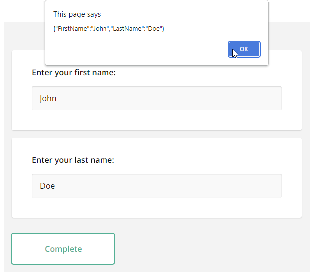

# Add a Survey to a Vue.js Application

This step-by-step tutorial will help you get started with the SurveyJS Form Library in a Vue 2 or Vue 3 application. As a result, you will create a survey displayed below:

<iframe src="https://codesandbox.io/embed/surveyjs-add-a-survey-to-a-vue-application-nn9zm?fontsize=14&hidenavigation=1&module=%2Fsrc%2Fcomponents%2FMyFirstSurvey.vue&theme=dark"
    style="width:100%; height:500px; border:0; border-radius: 4px; overflow:hidden;"
    title="SurveyJS - Add a Survey to a Vue Application"
    sandbox="allow-forms allow-modals allow-popups allow-presentation allow-same-origin allow-scripts"
></iframe>

[View Full Code for Vue 2](https://github.com/surveyjs/code-examples/tree/main/get-started-library/vue (linkStyle))
[View Full Code for Vue 3](https://github.com/surveyjs/code-examples/tree/main/get-started-library/vue3 (linkStyle))

## Add a Survey to a Vue 2 Application

### Install the `survey-vue-ui` npm Package

SurveyJS Form Library for Vue 2 consists of two npm packages: [`survey-core`](https://www.npmjs.com/package/survey-core) (platform-independent code) and [`survey-vue-ui`](https://www.npmjs.com/package/survey-vue-ui) (rendering code). Run the following command to install `survey-vue-ui`. The `survey-core` package will be installed automatically as a dependency.

```cmd
npm install survey-vue-ui --save
```

### Configure Styles

SurveyJS Form Library is shipped with several predefined themes illustrated below and a flexible theme customization mechanism based on CSS variables.


To add SurveyJS themes to your application, open the Vue component that will render your survey and import the Form Library style sheet:

```html
<template>
  <!-- ... -->
</template>

<script>
import 'survey-core/defaultV2.min.css';
</script>
```

This style sheet applies the Default theme. If you want to apply a different predefined theme or create a custom theme, refer to the following help topic for detailed instructions: [Themes & Styles](https://surveyjs.io/form-library/documentation/manage-default-themes-and-styles).

> Previous to v1.9.100, SurveyJS also supplied the Modern theme, which is now obsolete. Please migrate to one of the predefined themes or create a custom theme.

### Create a Model

A model describes the layout and contents of your survey. The simplest survey model contains one or several questions without layout modifications.

Models are specified by model schemas (JSON objects). For example, the following model schema declares two [textual questions](https://surveyjs.io/Documentation/Library?id=questiontextmodel), each with a [title](https://surveyjs.io/Documentation/Library?id=questiontextmodel#title) and a [name](https://surveyjs.io/Documentation/Library?id=questiontextmodel#name). Titles are displayed on screen. Names are used to identify the questions in code.

```html
const surveyJson = {
  elements: [{
    name: "FirstName",
    title: "Enter your first name:",
    type: "text"
  }, {
    name: "LastName",
    title: "Enter your last name:",
    type: "text"
  }]
};
```

To instantiate a model, pass the model schema to the [Model](https://surveyjs.io/Documentation/Library?id=surveymodel) constructor as shown in the code below. The model instance will be later used to render the survey. 

```html
<template>
  <!-- ... -->
</template>

<script>
// ...
import { ..., Model } from 'survey-core';

export default {
  data() {
    const survey = new Model(surveyJson);
    return {
      survey
    }
  },
}
</script>

```

<details>
    <summary>View Full Code</summary>  

```html
<template>
  <!-- ... -->
</template>

<script>
import 'survey-core/defaultV2.min.css';
import { Model } from 'survey-core';

const surveyJson = {
  elements: [{
    name: "FirstName",
    title: "Enter your first name:",
    type: "text"
  }, {
    name: "LastName",
    title: "Enter your last name:",
    type: "text"
  }]
};

export default {
  name: 'MyFirstSurvey',
  data() {
    const survey = new Model(surveyJson);
    return {
      survey
    }
  },
}
</script>
```
</details>


### Render the Survey

To render a survey, import the `Survey` component, add it to the template, and pass the model instance you created in the previous step to the component's `survey` attribute:

```html
<template>
  <Survey :survey="survey" />
</template>

<script>
// ...
import { Survey } from 'survey-vue-ui';
// ...
const surveyJson = { ... };

export default {
  components: {
    Survey
  },
  data() {
    const survey = new Model(surveyJson);
    return {
      survey
    }
  },
}
</script>
```

If you replicate the code correctly, you should see the following survey:


<details>
    <summary>View Full Code</summary>  

```html
<template>
  <Survey :survey="survey" />
</template>

<script>
import 'survey-core/defaultV2.min.css';
import { Model } from 'survey-core';
import { Survey } from 'survey-vue-ui';

const surveyJson = {
  elements: [{
    name: "FirstName",
    title: "Enter your first name:",
    type: "text"
  }, {
    name: "LastName",
    title: "Enter your last name:",
    type: "text"
  }]
};

export default {
  name: 'MyFirstSurvey',
  components: {
    Survey
  },
  data() {
    const survey = new Model(surveyJson);
    return {
      survey
    }
  },
}
</script>
```
</details>

### Handle Survey Completion

After a respondent completes a survey, the results are available within the [onComplete](https://surveyjs.io/Documentation/Library?id=surveymodel#onComplete) event handler. In real-world applications, you should send the results to a server where they will be stored in a database and processed:

```html
<template>
  <!-- ... -->
</template>

<script>
// ...
const SURVEY_ID = 1;

export default {
  // ...
  data() {
    const survey = new Model(surveyJson);
    survey.onComplete.add(this.surveyComplete);

    return {
      survey
    }
  },
  methods: {
    surveyComplete (sender) {
      saveSurveyResults(
        "https://your-web-service.com/" + SURVEY_ID,
        sender.data
      )
    }
  },
}

function saveSurveyResults(url, json) {
  fetch(url, {
    method: 'POST',
    headers: {
      'Content-Type': 'application/json;charset=UTF-8'
    },
    body: JSON.stringify(json)
  })
  .then(response => {
    if (response.ok) {
      // Handle success
    } else {
      // Handle error
    }
  })
  .catch(error => {
    // Handle error
  });
}
</script>
```

In this tutorial, the results are simply output in an alert dialog:

```html
<template>
  <!-- ... -->
</template>

<script>
// ...
export default {
  // ...
  data() {
    const survey = new Model(surveyJson);
    survey.onComplete.add(this.alertResults);

    return {
      survey
    }
  },
  methods: {
    alertResults (sender) {
      const results = JSON.stringify(sender.data);
      alert(results);
    }
  },
}
</script>
```



As you can see, survey results are saved in a JSON object. Its properties correspond to the `name` property values of your questions in the model schema.

To view the application, run `npm run serve` in a command line and open [http://localhost:8080/](http://localhost:8080/) in your browser.

<details>
    <summary>View Full Code</summary>  

```html
<template>
  <Survey :survey="survey" />
</template>

<script>
import 'survey-core/defaultV2.min.css';
import { Model } from 'survey-core';
import { Survey } from 'survey-vue-ui';

const surveyJson = {
  elements: [{
    name: "FirstName",
    title: "Enter your first name:",
    type: "text"
  }, {
    name: "LastName",
    title: "Enter your last name:",
    type: "text"
  }]
};

export default {
  name: 'MyFirstSurvey',
  components: {
    Survey
  },
  data() {
    const survey = new Model(surveyJson);
    survey.onComplete.add(this.alertResults);

    return {
      survey
    }
  },
  methods: {
    alertResults (sender) {
      const results = JSON.stringify(sender.data);
      alert(results);
    }
  },
}
</script>
```
</details>

[View Full Code on GitHub](https://github.com/surveyjs/code-examples/tree/main/get-started-library/vue (linkStyle))

## Add a Survey to a Vue 3 Application

### Install the `survey-vue3-ui` npm Package

SurveyJS Form Library for Vue 3 consists of two npm packages: [`survey-core`](https://www.npmjs.com/package/survey-core) (platform-independent code) and [`survey-vue3-ui`](https://www.npmjs.com/package/survey-vue3-ui) (rendering code). Run the following command to install `survey-vue3-ui`. The `survey-core` package will be installed automatically as a dependency.

```cmd
npm install survey-vue3-ui --save
```

### Configure Styles

SurveyJS Form Library is shipped with several predefined themes illustrated below and a flexible theme customization mechanism based on CSS variables.


To add SurveyJS themes to your application, open the Vue component that will render your survey and import the Form Library style sheet:

```html
<script setup lang="ts">
import 'survey-core/defaultV2.min.css';
</script>

<template>
  <!-- ... -->
</template>
```

This style sheet applies the Default theme. If you want to apply a different predefined theme or create a custom theme, refer to the following help topic for detailed instructions: [Themes & Styles](https://surveyjs.io/form-library/documentation/manage-default-themes-and-styles).

> Previous to v1.9.100, SurveyJS also supplied the Modern theme, which is now obsolete. Please migrate to one of the predefined themes or create a custom theme.

### Create a Model

A model describes the layout and contents of your survey. The simplest survey model contains one or several questions without layout modifications.

Models are specified by model schemas (JSON objects). For example, the following model schema declares two [textual questions](https://surveyjs.io/Documentation/Library?id=questiontextmodel), each with a [title](https://surveyjs.io/Documentation/Library?id=questiontextmodel#title) and a [name](https://surveyjs.io/Documentation/Library?id=questiontextmodel#name). Titles are displayed on screen. Names are used to identify the questions in code.

```html
const surveyJson = {
  elements: [{
    name: "FirstName",
    title: "Enter your first name:",
    type: "text"
  }, {
    name: "LastName",
    title: "Enter your last name:",
    type: "text"
  }]
};
```

To instantiate a model, pass the model schema to the [Model](https://surveyjs.io/Documentation/Library?id=surveymodel) constructor as shown in the code below. The model instance will be later used to render the survey. 

```html
<script setup lang="ts">
// ...
import { Model } from 'survey-core';

const surveyJson = { ... };
const survey = new Model(surveyJson);
</script>

<template>
  <!-- ... -->
</template>
```

<details>
    <summary>View Full Code</summary>  

```html
<script setup lang="ts">
import 'survey-core/defaultV2.min.css';
import { Model } from 'survey-core';

const surveyJson = {
  elements: [{
    name: "FirstName",
    title: "Enter your first name:",
    type: "text"
  }, {
    name: "LastName",
    title: "Enter your last name:",
    type: "text"
  }]
};

const survey = new Model(surveyJson);
</script>

<template>
  <!-- ... -->
</template>
```
</details>


### Render the Survey

Survey rendering code is encapsulated in the `SurveyComponent` component. To use it in your template, you need to install `surveyPlugin`. Open the `main.ts` file, import `surveyPlugin`, and install it using the `app.use()` method:

```html
// main.ts
import { createApp } from 'vue'
import { surveyPlugin } from 'survey-vue3-ui'
import App from './App.vue'

createApp(App).use(surveyPlugin).mount('#app')
```

To render a survey, add `SurveyComponent` to your template, and pass the model instance you created in the previous step to the component's `model` attribute:

```html
<script setup lang="ts">
// ...
</script>

<template>
  <SurveyComponent :model="survey" />
</template>
```

If you replicate the code correctly, you should see the following survey:


<details>
    <summary>View Full Code</summary>  

```html
<script setup lang="ts">
import 'survey-core/defaultV2.min.css';
import { Model } from 'survey-core';

const surveyJson = {
  elements: [{
    name: "FirstName",
    title: "Enter your first name:",
    type: "text"
  }, {
    name: "LastName",
    title: "Enter your last name:",
    type: "text"
  }]
};

const survey = new Model(surveyJson);
</script>

<template>
  <SurveyComponent :model="survey" />
</template>
```
</details>

### Handle Survey Completion

After a respondent completes a survey, the results are available within the [onComplete](https://surveyjs.io/Documentation/Library?id=surveymodel#onComplete) event handler. In real-world applications, you should send the results to a server where they will be stored in a database and processed:

```html
<script setup lang="ts">
// ...
const SURVEY_ID = 1;

const survey = new Model(surveyJson);
survey.onComplete.add(surveyComplete);

const surveyComplete = (sender: any) => {
  saveSurveyResults(
    "https://your-web-service.com/" + SURVEY_ID,
    sender.data
  )
}

// function saveSurveyResults(url: string | URL, json: object) {
//   fetch(url, {
//     method: 'POST',
//     headers: {
//       'Content-Type': 'application/json;charset=UTF-8'
//     },
//     body: JSON.stringify(json)
//   })
//   .then(response => {
//     if (response.ok) {
//       // Handle success
//     } else {
//       // Handle error
//     }
//   })
//   .catch(error => {
//     // Handle error
//   });
// }
</script>

<template>
  <!-- ... -->
</template>
```

In this tutorial, the results are simply output in an alert dialog:

```html
<script setup lang="ts">
// ...
const survey = new Model(surveyJson);
survey.onComplete.add(alertResults);

const alertResults = (sender: any) => {
  const results = JSON.stringify(sender.data);
  alert(results);
}
</script>

<template>
  <!-- ... -->
</template>
```


As you can see, survey results are saved in a JSON object. Its properties correspond to the `name` property values of your questions in the model schema.

To view the application, run `npm run dev` in a command line and open [http://localhost:5173/](http://localhost:5173/) in your browser.

<details>
    <summary>View Full Code</summary>  

```html
<script setup lang="ts">
import 'survey-core/defaultV2.min.css';
import { Model } from 'survey-core';

const surveyJson = {
  elements: [{
    name: "FirstName",
    title: "Enter your first name:",
    type: "text"
  }, {
    name: "LastName",
    title: "Enter your last name:",
    type: "text"
  }]
};

const alertResults = (sender: any) => {
  const results = JSON.stringify(sender.data);
  alert(results);
}

const survey = new Model(surveyJson);
survey.onComplete.add(alertResults);
</script>

<template>
  <SurveyComponent :model="survey" />
</template>
```
</details>

[View Full Code on GitHub](https://github.com/surveyjs/code-examples/tree/main/get-started-library/vue3 (linkStyle))

## Further Reading

- [Create a Simple Survey](https://surveyjs.io/Documentation/Library?id=design-survey-create-a-simple-survey)
- [Create a Multi-Page Survey](https://surveyjs.io/Documentation/Library?id=design-survey-create-a-multi-page-survey)
- [Create a Quiz](https://surveyjs.io/Documentation/Library?id=design-survey-create-a-quiz)
