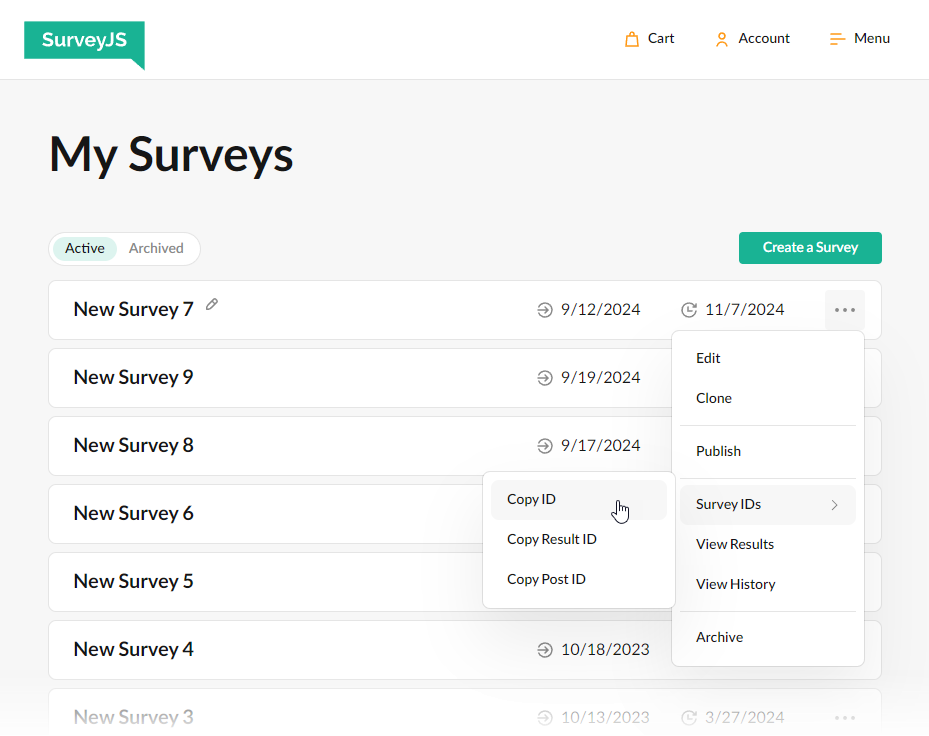

# Store Survey Results

Survey results are JSON objects that you can store in your own database or in the SurveyJS Service.

- [Store Survey Results in Your Own Database](#store-survey-results-in-your-own-database)
- [Store Survey Results in the SurveyJS Service](#store-survey-results-in-the-surveyjs-service)

## Store Survey Results in Your Own Database

To store survey results in your own database, handle the [`onComplete`](https://surveyjs.io/Documentation/Library?id=surveymodel#onComplete) event raised in response to a click on the Complete button. The following code shows how to use this event to send survey results to your server:

```js
import { Model } from "survey-core";

const surveyJson = { ... };

const survey = new Model(surveyJson);
survey.onComplete.add(function (sender, options) {
  // Display the "Saving..." message (pass a string value to display a custom message)
  options.showSaveInProgress();
  const xhr = new XMLHttpRequest();
  xhr.open("POST", "your/server/url");
  xhr.setRequestHeader("Content-Type", "application/json; charset=utf-8");
  xhr.onload = xhr.onerror = function () {
    if (xhr.status == 200) {
      // Display the "Success" message (pass a string value to display a custom message)
      options.showSaveSuccess();
      // Alternatively, you can clear all messages:
      // options.clearSaveMessages();
    } else {
      // Display the "Error" message (pass a string value to display a custom message)
      options.showSaveError();
    }
  };
  xhr.send(JSON.stringify(sender.data));
});
```

The `onComplete` event handler only sends survey results in JSON format to your server. The way you store them fully depends on your backend.

If you are running a NodeJS server, you can check survey results before saving them. On the server, create a `SurveyModel` and call its [`clearIncorrectValues(true)`](https://surveyjs.io/form-library/documentation/api-reference/survey-data-model#clearIncorrectValues) method. This method verifies a survey result JSON object against the survey JSON schema and deletes property values that cannot be assigned to a question (such as choice options unlisted in a `choices` array) and property values that do not correspond to any question or [calculated value](https://surveyjs.io/form-library/documentation/design-survey/conditional-logic#calculated-values).

```js
// Server-side code for a NodeJS backend
import { Model } from "survey-core";

const surveyJson = { ... };
const survey = new Model(surveyJson);

survey.data = initialSurveyResultJson;
survey.clearIncorrectValues(true);

const correctSurveyResultJson = survey.data;
```

## Store Survey Results in the SurveyJS Service

SurveyJS Service is a full-cycle survey solution. The service allows you to create a survey and store its JSON schema in our database. You can also load surveys from the database, display them to your clients, and send the results back to the service for storage and analysis.

> SurveyJS Service is meant as a demonstration of what you can build with SurveyJS products. SurveyJS assumes no responsibility for any consequence of misusing or violating any sensitive data communicated via the service. In real-world applications, we strongly recommend storing survey results and JSON schemas [in your own database](#store-survey-results-in-your-own-database).

Follow the steps below to start using the SurveyJS Service:

1. [Log in or register](https://surveyjs.io/Account/Login) on the SurveyJS website.
1. [Create a new survey](https://surveyjs.io/Service/MySurveys).
1. Copy the Survey ID and Post ID:
    
1. Assign the IDs to the [`surveyId`](https://surveyjs.io/Documentation/Library?id=surveymodel#surveyId) and [`surveyPostId`](https://surveyjs.io/Documentation/Library?id=surveymodel#surveyPostId) properties:
    ```js
    const surveyJson = {
      "surveyId": "9b5f68e0-3be3-4695-85e6-919354159006",
      "surveyPostId": "dfce82b1-c081-45fe-b13e-fb2bd2977cc7"
    }
    ```
1. *(Optional)* Enable the [`surveyShowDataSaving`](https://surveyjs.io/Documentation/Library?id=surveymodel#surveyShowDataSaving) property to display saving progress and errors:
    ```js
    const surveyJson = {
      // ...
      "surveyShowDataSaving": true
    }
    ```

[View Demo](https://surveyjs.io/form-library/examples/service-send/ (linkStyle))

## See Also

- [Access Survey Results](/Documentation/Library?id=handle-survey-results-access)
- [Continue an Incomplete Survey](/Documentation/Library?id=handle-survey-results-continue-incomplete)
- [Merge Question Values](/Documentation/Library?id=design-survey-merge-question-values)