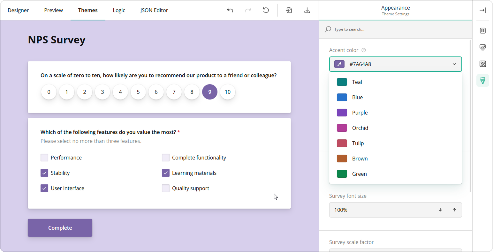

# Themes & Styles

This help topic describes how to add SurveyJS UI themes to your Angular, Vue, React, Knockout, or jQuery application, switch between them, or create a custom theme for your survey.

## Add SurveyJS Themes to Your Application

SurveyJS Form Library is shipped with predefined UI themes illustrated below. Each theme supports dark mode and a more compact view without panels. These options give you a total of 40 different theme variations out of the box.

<div id="themeGallery"></div>

To use a theme, you need to reference a SurveyJS style sheet. Refer to the following sections of Get Started help topics for detailed instructions:

- [Configure Styles in Angular](https://surveyjs.io/form-library/documentation/get-started-angular#configure-styles)
- [Configure Styles in Vue](https://surveyjs.io/form-library/documentation/get-started-vue#configure-styles)
- [Configure Styles in React](https://surveyjs.io/form-library/documentation/get-started-react#configure-styles)
- [Link SurveyJS Resources in Knockout](https://surveyjs.io/form-library/documentation/get-started-knockout#link-surveyjs-resources)
- [Link SurveyJS Resources in jQuery](https://surveyjs.io/form-library/documentation/get-started-jquery#link-surveyjs-resources)

## Apply a Predefined Theme

Predefined themes are distributed as JSON objects that specify CSS variables and other theme settings. You can find a full list of predefined themes and their variations on GitHub: [survey-core/themes](https://github.com/surveyjs/survey-library/tree/master/src/themes).

To apply a predefined theme in modular applications, import the theme object from its module and pass the object to `SurveyModel`'s [`applyTheme(theme)`](https://surveyjs.io/form-library/documentation/api-reference/survey-data-model#applyTheme) method. The following code shows how to apply the Layered Dark Panelless theme:

```js
import { Model } from "survey-core";
/*
  Don't forget to import or reference the Default V2 style sheet
  as described in the Get Started with SurveyJS article for your framework
*/
import { LayeredDarkPanelless } "survey-core/themes/layered-dark-panelless";

const surveyJson = { ... };
const survey = new Model(surveyJson);
survey.applyTheme(LayeredDarkPanelless);
```

In classic script applications, reference a theme script _after_ the `survey-core` script and style sheet. Pass the theme object to the `applyTheme(theme)` method, as shown below:

```html
<head>
    <!-- ... -->
    <link href="https://unpkg.com/survey-core/defaultV2.min.css" type="text/css" rel="stylesheet">
    <script type="text/javascript" src="https://unpkg.com/survey-core/survey.core.min.js"></script>
    <script type="text/javascript" src="https://unpkg.com/survey-core/themes/layered-dark-panelless.min.js"></script>
    <!-- ... -->
</head>
```

```js
const surveyJson = { ... };
const survey = new Survey.Model(surveyJson);
survey.applyTheme(SurveyTheme.LayeredDarkPanelless);
```

## Switch Between Themes

If you want to add more than one SurveyJS theme to your application, import them or reference their scripts and call `SurveyModel`'s [`applyTheme(theme)`](https://surveyjs.io/form-library/documentation/api-reference/survey-data-model#applyTheme) method to specify an active theme. For example, the following code imports the Contrast Dark and Contrast Light themes and applies the latter:

```js
// In modular applications:
import { Model } from "survey-core";
import { ContrastDark } from "survey-core/themes/contrast-dark";
import { ContrastLight } from "survey-core/themes/contrast-light";

const surveyJson = { ... };
const survey = new Model(surveyJson);
survey.applyTheme(ContrastLight);
```

```html
<!-- In classic script applications: -->
<head>
    <!-- ... -->
    <link href="https://unpkg.com/survey-core/defaultV2.min.css" type="text/css" rel="stylesheet">
    <script type="text/javascript" src="https://unpkg.com/survey-core/survey.core.min.js"></script>
    <script type="text/javascript" src="https://unpkg.com/survey-core/themes/contrast-dark.min.js"></script>
    <script type="text/javascript" src="https://unpkg.com/survey-core/themes/contrast-light.min.js"></script>
    <!-- ... -->
</head>
```

```js
const surveyJson = { ... };
const survey = new Survey.Model(surveyJson);
survey.applyTheme(SurveyTheme.ContrastLight);
```

## Create a Custom Theme

SurveyJS themes use CSS variables to specify colors, fonts, sizes, and other survey appearance settings. To create a custom theme, you need to change these variables. You can do this in Theme Editor&mdash;a UI theme designer with a user-friendly interface.



Theme Editor is integrated into Survey Creator. Open our [all-in-one demo](/create-free-survey), switch to the Themes tab, and change theme settings using UI controls. Once you finish customization, click the Export button to download a JSON object with CSS variables and other theme settings:


To apply your custom theme, pass the downloaded JSON object to `SurveyModel`'s [`applyTheme(theme)`](https://surveyjs.io/form-library/documentation/api-reference/survey-data-model#applyTheme) method:

```js
import { Model } from "survey-core";
const surveyJson = { ... };
const survey = new Model(surveyJson);

survey.applyTheme({
  "cssVariables": {
      // ...
  },
  "themeName": "doubleborder",
  "colorPalette": "dark",
  "isPanelless": true
});
```

## Apply Custom CSS Classes

You can apply individual custom CSS classes to all survey elements of a specific type. To do this, define a JavaScript object in which keys specify survey elements and values specify CSS classes. For information on the object structure, refer to the following file on GitHub: [defaultV2Css.ts](https://github.com/surveyjs/survey-library/blob/master/src/defaultCss/defaultV2Css.ts#L13). Assign this object to [`SurveyModel`](https://surveyjs.io/form-library/documentation/api-reference/survey-data-model)'s `css` property.

[View Demo](https://surveyjs.io/form-library/examples/survey-customcss/ (linkStyle))

In addition, the `SurveyModel` object raises events that allow you to override CSS classes for individual questions, panels, pages, and choice items. Refer to the following event descriptions in the API reference for more information:

- [`onUpdateQuestionCssClasses`](https://surveyjs.io/form-library/documentation/api-reference/survey-data-model#onUpdateQuestionCssClasses)
- [`onUpdatePanelCssClasses`](https://surveyjs.io/form-library/documentation/api-reference/survey-data-model#onUpdatePanelCssClasses)
- [`onUpdatePageCssClasses`](https://surveyjs.io/form-library/documentation/api-reference/survey-data-model#onUpdatePageCssClasses)
- [`onUpdateChoiceItemCss`](https://surveyjs.io/form-library/documentation/api-reference/survey-data-model#onUpdateChoiceItemCss)

[View Demo](https://surveyjs.io/form-library/examples/survey-cssclasses/ (linkStyle))

## Switch Between Themes (Obsolete Approach)

If your application contains more than one obsolete SurveyJS theme (Default, Modern, Default V2), call `StylesManager`'s `applyTheme(themeName)` method to specify an active theme. Pass one of the following theme names as the method's argument:

- `"defaultV2"`
- `"modern"`
- `"default"`
- `"orange"`
- `"darkblue"`
- `"darkrose"`
- `"stone"`
- `"winter"`
- `"winterstone"`

The code example below shows how to apply the Default V2 theme:

```js
import { StylesManager } from 'survey-core';

StylesManager.applyTheme("defaultV2");
```

## Bootstrap Support (Obsolete)

SurveyJS includes themes designed for use with Bootstrap and Bootstrap Material. However, they are obsolete and no longer receive updates.

Previously, Bootstrap integrations were part of the main package. Since v1.9.69, they are shipped as separate modules/scripts. The following code shows how to apply the Bootstrap or Bootstrap Material theme by importing a module:

```js
// Apply the Bootstrap theme
import { bootstrapThemeName } from "survey-core/plugins/bootstrap-integration";
import { StylesManager } from 'survey-core';

StylesManager.applyTheme(bootstrapThemeName);
```

```js
// Apply the Bootstrap Material theme
import { bootstrapMaterialThemeName } from "survey-core/plugins/bootstrap-material-integration";
import { StylesManager } from 'survey-core';

StylesManager.applyTheme(bootstrapMaterialThemeName);
```

The code below shows how to apply the themes by referencing a script:

```html
<!-- Apply the Bootstrap theme -->
<script src="https://unpkg.com/survey-core/plugins/bootstrap-integration.min.js"></script>
```
```js
Survey.StylesManager.applyTheme("bootstrap");
```

```html
<!-- Apply the Bootstrap Material theme -->
<script src="https://unpkg.com/survey-core/plugins/bootstrap-material-integration.min.js"></script>
```
```js
Survey.StylesManager.applyTheme("bootstrapmaterial");
```

Bootstrap theme customization in code has also changed. Objects that specify applied CSS classes have been moved to the integration modules/scripts mentioned above.

**Previously:**

```js
// Assign another CSS class in Bootstrap (obsolete approach)
Survey.defaultBootstrapCss.page.description = "sv_page_description";

// In modular applications
import { defaultBootstrapCss } from "survey-core";

defaultBootstrapCss.page.description = "sv_page_description";
```

```js
// Assign another CSS class in Bootstrap Material (obsolete approach)
Survey.defaultBootstrapMaterialCss.page.description = "sv_page_description";

// In modular applications
import { defaultBootstrapMaterialCss } from "survey-core";

defaultBootstrapMaterialCss.page.description = "sv_page_description";
```

**Since v1.9.69:**

```js
// Assign another CSS class in Bootstrap (relevant approach)
SurveyBootstrap.defaultCss.page.description = "sv_page_description";

// In modular applications
import { defaultCss } from "survey-core/plugins/bootstrap-integration";

defaultCss.page.description = "sv_page_description";
```

```js
// Assign another CSS class in Bootstrap Material (relevant approach)
SurveyBootstrapMaterial.defaultCss.page.description = "sv_page_description";

// In modular applications
import { defaultCss } from "survey-core/plugins/bootstrap-material-integration";

defaultCss.page.description = "sv_page_description";
```

## See Also

- [UI Icons](https://surveyjs.io/form-library/documentation/icons)
